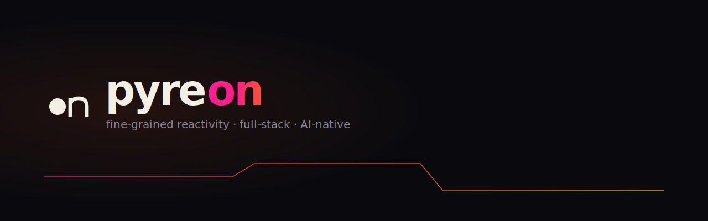

<p align="center">
  
</p>

<p align="center">
  <a href="https://github.com/pyreon/pyreon/actions/workflows/ci.yml"></a>
  <a href="LICENSE"></a>
  
</p>

# Pyreon

A signal-based UI framework with fine-grained reactivity. No virtual DOM, no component re-renders — only the exact DOM nodes that depend on a changed signal are updated.

## Why Pyreon

- **Components run once.** State changes update individual DOM nodes, not entire component subtrees.
- **No dependency arrays.** Signals track their own subscribers automatically.
- **~6 kB gzip** for core + runtime-dom. Tree-shakeable — only what you use ships to the client.
- **Full-stack.** SSR streaming, static site generation, island architecture, and client-side SPA — all from one framework.
- **Top-tier performance.** Fastest of the frameworks measured on the synthetic row-list benchmark — create 1,000 rows in ~9ms (Vue 10ms, Solid 10.4ms, React 11.6ms), and **2.4–3× faster than React, Svelte and Preact** at 10,000 rows. Leads or ties every op except single-row remove, where Solid edges it. (Real Chromium, published deps; mid-pack on retained memory.)
- **65 packages.** Forms, routing, state management, charts, drag & drop, i18n, and more.
- **Migration paths.** Drop-in compat layers for React, Vue, Solid, and Preact.

## Quick Start

```bash
bun add @pyreon/core @pyreon/reactivity @pyreon/runtime-dom
bun add @pyreon/vite-plugin --dev
```

**vite.config.ts**

```ts
import { defineConfig } from 'vite'
import pyreon from '@pyreon/vite-plugin'

export default defineConfig({
  plugins: [pyreon()],
})
```

**tsconfig.json**

```json
{
  "compilerOptions": {
    "jsx": "preserve",
    "jsxImportSource": "@pyreon/core"
  }
}
```

**src/App.tsx**

```tsx
import { signal } from '@pyreon/reactivity'

function Counter() {
  const count = signal(0)
  return (
    <div>
      <button onClick={() => count.update((n) => n - 1)}>-</button>
      <span>{count()}</span>
      <button onClick={() => count.update((n) => n + 1)}>+</button>
    </div>
  )
}

export default Counter
```

**src/main.tsx**

```tsx
import { mount } from '@pyreon/runtime-dom'
import Counter from './App'

mount(<Counter />, document.getElementById('app')!)
```

The `count()` call inside JSX is a reactive getter. Pyreon wraps it in an effect automatically, so only that text node updates when `count` changes. The `Counter` function itself runs exactly once.

## Packages

### Core

| Package | Description |
|---|---|
| [`@pyreon/reactivity`](packages/core/reactivity/) | `signal`, `computed`, `effect`, `batch`, `createSelector`, `createStore`, `untrack` |
| [`@pyreon/core`](packages/core/core/) | `h()`, JSX runtime, `Fragment`, `For`, `Show`, `Portal`, `Suspense`, `ErrorBoundary`, `lazy`, `Dynamic`, context, lifecycle |
| [`@pyreon/runtime-dom`](packages/core/runtime-dom/) | `mount()`, `hydrateRoot()`, `Transition`, `TransitionGroup`, `KeepAlive` |
| [`@pyreon/runtime-server`](packages/core/runtime-server/) | `renderToString()`, `renderToStream()` |
| [`@pyreon/compiler`](packages/core/compiler/) | JSX transform with smart `shouldWrap`, static hoisting, template emission |
| [`@pyreon/router`](packages/core/router/) | Hash/history router, nested routes, guards, loaders, prefetching, `useIsActive` |
| [`@pyreon/head`](packages/core/head/) | `useHead()` — reactive document head management with SSR |
| [`@pyreon/server`](packages/core/server/) | `createHandler` (SSR), `prerender` (SSG), `island()` architecture |

### Fundamentals

| Package | Description |
|---|---|
| [`@pyreon/store`](packages/fundamentals/store/) | Composition stores — `defineStore`, patch, subscribe, plugins; schema-driven stores strictly typed from any Standard Schema |
| [`@pyreon/state-tree`](packages/fundamentals/state-tree/) | Structured reactive state — models, snapshots, patches, middleware |
| [`@pyreon/form`](packages/fundamentals/form/) | Signal-based forms — fields, validation, submission, arrays, context, dynamic + file fields, focus-on-error, raw Standard Schema |
| [`@pyreon/validation`](packages/fundamentals/validation/) | Universal validation gate — owns the validation contract + Standard Schema bridge (`standardSchemaToValidator`, `InferSchema`); adapters for Zod / Valibot / ArkType; zero pyreon deps |
| [`@pyreon/query`](packages/fundamentals/query/) | TanStack Query adapter with Suspense, SSE, WebSocket subscriptions |
| [`@pyreon/table`](packages/fundamentals/table/) | TanStack Table adapter with reactive state sync |
| [`@pyreon/virtual`](packages/fundamentals/virtual/) | TanStack Virtual adapter — element and window virtualizers |
| [`@pyreon/i18n`](packages/fundamentals/i18n/) | Reactive i18n — async namespaces, plurals, interpolation |
| [`@pyreon/feature`](packages/fundamentals/feature/) | Schema-driven CRUD — auto-generated queries, forms, tables, stores |
| [`@pyreon/charts`](packages/fundamentals/charts/) | Reactive ECharts bridge with lazy loading |
| [`@pyreon/storage`](packages/fundamentals/storage/) | Reactive storage — localStorage, sessionStorage, cookies, IndexedDB |
| [`@pyreon/hooks`](packages/fundamentals/hooks/) | 40 hooks — useHover, useFocus, useBreakpoint, useClipboard, useDialog, useTimeAgo, etc. |
| [`@pyreon/hotkeys`](packages/fundamentals/hotkeys/) | Keyboard shortcuts — scope-aware, modifier keys, conflict detection |
| [`@pyreon/permissions`](packages/fundamentals/permissions/) | Reactive RBAC/ABAC — wildcards, predicates, feature flags |
| [`@pyreon/machine`](packages/fundamentals/machine/) | Reactive state machines — type-safe transitions, guards |
| [`@pyreon/flow`](packages/fundamentals/flow/) | Flow diagrams — signal-native nodes, edges, pan/zoom, auto-layout |
| [`@pyreon/code`](packages/fundamentals/code/) | Code editor — CodeMirror 6 with signals, minimap, diff editor |
| [`@pyreon/document`](packages/fundamentals/document/) | Universal document rendering — 18 primitives, 20 output formats |
| [`@pyreon/rx`](packages/fundamentals/rx/) | Signal-aware transforms — filter, map, sortBy, groupBy, pipe, debounce, 37 functions |
| [`@pyreon/toast`](packages/fundamentals/toast/) | Toast notifications — imperative API, auto-dismiss, a11y |
| [`@pyreon/url-state`](packages/fundamentals/url-state/) | URL-synced state — auto type coercion, schema mode, SSR-safe |
| [`@pyreon/dnd`](packages/fundamentals/dnd/) | Drag and drop — sortable, droppable, file drop, keyboard support |

### UI System

| Package | Description |
|---|---|
| [`@pyreon/ui-core`](packages/ui-system/ui-core/) | Config engine, `PyreonUI` provider, utilities |
| [`@pyreon/styler`](packages/ui-system/styler/) | CSS-in-JS — `styled()`, `css`, `keyframes`, theming |
| [`@pyreon/unistyle`](packages/ui-system/unistyle/) | Responsive breakpoints, CSS property mappings |
| [`@pyreon/elements`](packages/ui-system/elements/) | 5 primitives — Element, Text, List, Overlay, Portal |
| [`@pyreon/attrs`](packages/ui-system/attrs/) | Chainable HOC factory — `.attrs()`, `.config()`, `.statics()` |
| [`@pyreon/rocketstyle`](packages/ui-system/rocketstyle/) | Multi-state styling — states, sizes, variants, themes, dark mode |
| [`@pyreon/coolgrid`](packages/ui-system/coolgrid/) | 12-column responsive grid |
| [`@pyreon/kinetic`](packages/ui-system/kinetic/) | CSS-transition animations |
| [`@pyreon/kinetic-presets`](packages/ui-system/kinetic-presets/) | 120+ animation presets |

### Tools

| Package | Description |
|---|---|
| [`@pyreon/vite-plugin`](packages/tools/vite-plugin/) | JSX transform, signal-preserving HMR, SSR middleware, compat aliases |
| [`@pyreon/lint`](packages/tools/lint/) | 94 Pyreon-specific lint rules across 18 categories — reactivity, JSX, SSR, performance |
| [`@pyreon/storybook`](packages/tools/storybook/) | Storybook renderer for Pyreon components |
| [`@pyreon/typescript`](packages/tools/typescript/) | TypeScript config presets |
| [`@pyreon/react-compat`](packages/tools/react-compat/) | Drop-in React compatibility layer |
| [`@pyreon/preact-compat`](packages/tools/preact-compat/) | Drop-in Preact compatibility layer |
| [`@pyreon/vue-compat`](packages/tools/vue-compat/) | Drop-in Vue compatibility layer |
| [`@pyreon/solid-compat`](packages/tools/solid-compat/) | Drop-in Solid compatibility layer |

## How It Works

```
Signal write -> notify subscribers -> re-run affected effects -> patch DOM nodes
```

There is no virtual DOM tree. There is no diffing pass. Each signal maintains a `Set<Effect>` of subscribers. When a signal is written, only those effects re-run, and each effect updates exactly one DOM node.

**React (every state change):**

```
setState -> re-run component -> build VDOM -> diff VDOM -> patch DOM
```

**Pyreon (every signal write):**

```
signal.set() -> re-run 1 effect -> update 1 DOM node
```

## Framework Comparison

| Feature | React 19 | Vue 3 | SolidJS | Pyreon |
|---|---|---|---|---|
| Reactivity | VDOM + re-render | Proxy + VDOM | Fine-grained signals | Fine-grained signals |
| Component re-runs | Every state change | Every state change | Never | Never |
| SSR streaming | Yes | Yes | Yes | Yes |
| Island architecture | No | No | Partial | Yes |
| Bundle (core) | ~42 kB | ~34 kB | ~7 kB | ~6 kB |
| Migration support | -- | -- | -- | React, Vue, Solid, Preact |

## Documentation

Full documentation at [pyreon.dev](https://pyreon.dev) (Pyreon-native site in `docs/` — powered by @pyreon/zero + @pyreon/zero-content).

## Development

```bash
bun install                # install dependencies
bun run test               # run all tests (7,500+)
bun run lint               # lint (oxlint)
bun run format             # format (oxfmt)
bun run typecheck          # typecheck all packages
```

The monorepo uses Bun workspaces with 65 packages across 5 categories (`packages/core/`, `packages/fundamentals/`, `packages/ui-system/`, `packages/tools/`, `packages/zero/`). Each package resolves `src/` directly via the `"bun"` export condition — no build step needed during development.

## License

MIT
